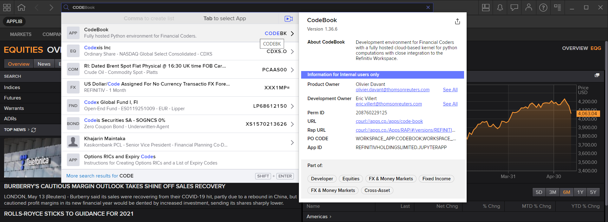
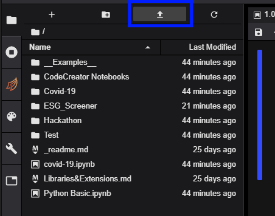

# How to use SCREENER and RDP Search for finding Bonds ESG Data Workflow
- Last update: February 2022
- Environment: Windows 
- Compiler: Conda distribution, Python
- Prerequisite: Refinitiv Eikon or Refinitiv Workspace application with access to Eikon Data APIs and RDP


## <a id="overview"></a>Overview
This workflow shows how to use the Eikon SCREENER application with the [Eikon Data API](https://developers.refinitiv.com/en/api-catalog/eikon/eikon-data-api) and [Refinitiv Data Platform Library for Python](https://developers.refinitiv.com/en/api-catalog/refinitiv-data-platform/refinitiv-data-platform-libraries) together.


The example Notebook application use the Eikon SCREENER application with the Eikon Data API find the companies based on SCREENER query, then finds the Bonds that issued by the company with [Refinitiv Data Platform Library for Python](https://developers.refinitiv.com/en/api-catalog/refinitiv-data-platform/refinitiv-data-platform-libraries) Search function, and finally gets the Environmental, Social, and Governance (ESG) data of the Bonds via the Eikon Data API.

## <a id="prerequisite"></a>Prerequisite
This example requires the following dependencies software and libraries.
1. Refinitiv Eikon or Refinitiv Workspace application with access to Eikon Data APIs and RDP Library for Python
2. For JupyterLab user only, Python [Anaconda](https://www.anaconda.com/distribution/) or [MiniConda](https://docs.conda.io/en/latest/miniconda.html) distribution/package manager.
3. Access to Refinitiv Workspace/Eikon CodeBook application (or alternatively, the [JupyterLab](https://jupyterlab.readthedocs.io/en/stable/getting_started/installation.html) application)
4. Internet connection.

*Note:* 
- This Project has been qualified with Python version 3.8.8 and Conda version 4.10.1

Please contact your Refinitiv's representative to help you to access Refinitiv Workspace/Eikon and Refinitiv Data Platform credentials. 
* For JupyterLab user, you can generate/manage the AppKey by follow the steps in [Eikon Data API Quick Start](https://developers.refinitiv.com/en/api-catalog/eikon/eikon-data-api/quick-start) page.
* For JupyterLab user, please follow the steps on the *Getting Started for User ID* section of [Getting Start with Refinitiv Data Platform](https://developers.refinitiv.com/en/article-catalog/article/getting-start-with-refinitiv-data-platform) to setup your RDP credentials. 

## <a id="application_files"></a>Application Files
This example project contains the following files and folders
1. *CodeBook/ESG_Screener_RDP_Search.ipynb*: The CodeBook workflow application file.
2. *CodeBook/ESG_Screener.ipynb*: The CodeBook SCREENER example application file.
3. *JupyterLab/jupyterlab_ESG_Screener_RDP_Search.ipynb*: The JupyterLab workflow application file.
4. *JupyterLab/ESG_Screener.ipynb*: The JupyterLab SCREENER example application file.
5. *requirements.txt*: The project dependencies configuration file (for JupyterLab only).
6. *LICENSE.md*: Project's license file.
7. *README.md*: Project's README file.
8. *images*: Project images folder.

## <a id="eikon_setup"></a>Eikon Data API Setup

**For JupyterLab user only**: please follow a step-by-step guide to set up your Eikon Data API and your AppKey in [Eikon Data API Quick Start page](https://developers.refinitiv.com/en/api-catalog/eikon/eikon-data-api/quick-start). 

## <a id="running_codebook"></a>How to run this example with the CodeBook

If you are [Refinitiv Workspace](https://www.refinitiv.com/en/products/refinitiv-workspace) or [Eikon](https://www.refinitiv.com/en/products/eikon-trading-software) user, you can access [*CodeBook*](https://www.refinitiv.com/en/products/codebook), the cloud-hosted Jupyter Notebook development environment for Python scripting from the application. The CodeBook is natively available in Refinitiv Workspace and Eikon as an app (**no installation required!!**), providing access to Refinitiv APIs that are already pre-installed on the cloud.

You can upload the *CodeBook/ESG_Screener_RDP_Search.ipynb* and *CodeBook/ESG_Screener.ipynb* notebook application files to the your CodeBook with the following steps:

1. In the Eikon/Workspace application, search for the ```CodeBook``` (or ```CODEBK```).

    
2. Once the CodeBook finished initialize, click the upload button and select the *ESG_Screener_RDP_Search.ipynb* or *ESG_Screener.ipynb* notebook file.

    

Please see more detail regarding the CodeBook app in this [Use Eikon Data API or RDP Library in Python in CodeBook on Web Browser article](https://developers.refinitiv.com/en/article-catalog/article/use-eikon-data-api-or-rdp-library-python-codebook-web-browser).

## <a id="running_jupyterlab"></a>How to run this example with the JupyterLab

Please note that the Refinitiv Workspace/Eikon application integrates a Data API proxy that acts as an interface between the Eikon Data API Python library and the Eikon Data Platform. For this reason, the Refinitiv Workspace/Eikon application must be running when you use the Eikon Data API Python library.

The first step is to unzip or download the example project folder into a directory of your choice, then set up a Conda environment for running the application with the steps below.

1. Open Anaconda Prompt and go to the project's folder
2. Run the following command in the Anaconda Prompt application to create a Conda environment named *ESG_Bonds_Search* for the project.
    ```
    (base) $>conda create --name ESG_Bonds_Search python=3.8
    ```
3. Once the environment is created, activate Conda environment named ```ESG_Bonds_Search``` with this command in Anaconda Prompt.
    ```
    (base) $>conda activate ESG_Bonds_Search
    ```
4. Run the following command to install the JupyterLab application in the *ESG_Bonds_Search* environment ([Reference](https://jupyterlab.readthedocs.io/en/stable/getting_started/installation.html))
    ```
    (plotly_chart) $>conda install -c conda-forge jupyterlab
    ```
5. Once the JupyterLab application installation process success, run the following command to install Eikon Data API, RDP Library for Python, and all dependencies in the *ESG_Bonds_Search* environment
    ```
    (ESG_Bonds_Search) $>pip install -r requirements.txt
    ```
6. Once the dependencies installation process success, Set up your OS Environment variables with the following variables and values.
    ```
    RDP_USERNAME=YOUR_RDP_USERNAME
    RDP_PASSWORD=YOUR_RDP_PASSWORD
    RDP_APP_KEY=YOUR_RDP_APP_KEY_HERE
    EIKON_APP_KEY=YOUR_EIKON_APP_ID_HERE
    ```
7. Alternatively, create a file name ```.env``` with the following variables and values.
    ```
    #RDP
    RDP_USERNAME=YOUR_RDP_USERNAME
    RDP_PASSWORD=YOUR_RDP_PASSWORD
    RDP_APP_KEY=YOUR_RDP_APP_KEY_HERE
    # Eikon Data API
    EIKON_APP_KEY=YOUR_EIKON_APP_ID_HERE
    ```
    If you are choosing this way, do not add the ```.env``` to your version control/Git repository.
7. Open and log in Refinitiv Workspace/Eikon application with your Workspace/Eikon credential.
8. In the current Anaconda Prompt, go to the project's JupyterLab folder. Run the following command to start the JupyterLab application in the JupyterLab folder.
    ```
    (ESG_Bonds_Search) $>JupyterLab>jupyter lab
    ```


## <a id="references"></a>References

You can find more detail regarding the Eikon Data APIs, RDP Library for Python and related technologies from the following resources:
* [Refinitiv Eikon Data API page](https://developers.refinitiv.com/en/api-catalog/eikon/eikon-data-api) on the [Refinitiv Developer Community](https://developers.refinitiv.com/) web site.
* [Eikon Data API Quick Start Guide page](https://developers.refinitiv.com/en/api-catalog/eikon/eikon-data-api/quick-start).
* [Eikon Data API Tutorial page](https://developers.refinitiv.com/en/api-catalog/eikon/eikon-data-api/tutorials).
* [Python Quants Video Tutorial Series for Eikon API](https://community.developers.refinitiv.com/questions/37865/announcement-new-python-quants-video-tutorial-seri.html).
* [Eikon Data APY Python Reference Guide](https://developers.refinitiv.com/en/api-catalog/eikon/eikon-data-api/documentation#eikon-data-ap-is-for-python-reference-guide).
* [Eikon Data API Troubleshooting article](https://developers.refinitiv.com/en/article-catalog/article/eikon-data-api-python-troubleshooting-refinitiv).
* [Refinitiv Data Platform (RDP) Libraries](https://developers.refinitiv.com/en/api-catalog/refinitiv-data-platform/refinitiv-data-platform-libraries) on the [Refinitiv Developer Community](https://developers.refinitiv.com/) web site.
* [RDP Libraries Quick Start Guide page](https://developers.refinitiv.com/en/api-catalog/refinitiv-data-platform/refinitiv-data-platform-libraries/quick-start).
* [RDP Libraries Tutorial page](https://developers.refinitiv.com/en/api-catalog/refinitiv-data-platform/refinitiv-data-platform-libraries/tutorials).
* [Discover our Refinitiv Data Platform Library (part 1)](https://developers.refinitiv.com/en/article-catalog/article/discover-our-refinitiv-data-platform-library-part-1).
* [Discover our Refinitiv Data Platform Library (part 2)](https://developers.refinitiv.com/en/article-catalog/article/discover-our-refinitiv-data-platform-library-part-2).
* [Find Your Right Companies with SCREENER](https://developers.refinitiv.com/en/article-catalog/article/find-your-right-companies-with-screener-eikon-data-apis-python).
* [Building Search into your Application Workflow](https://developers.refinitiv.com/en/article-catalog/article/building-search-into-your-application-workflow).
* [Debt Structure Analysis on an Organizational Level](https://developers.refinitiv.com/en/article-catalog/article/debt-structure-analysis-on-an-organizational-level).

For any question related to this example or Eikon Data API, please use the Developers Community [Q&A Forum - Eikon Data API](https://community.developers.refinitiv.com/spaces/92/eikon-scripting-apis.html).

For any question related to this example or Eikon Data API, please use the Developers Community [Q&A Forum - Refinitiv Data Platform](https://community.developers.refinitiv.com/spaces/231/index.html).


## <a id="github"><a>GitHub
    
- [Building Search into your Application Workflow](https://github.com/Refinitiv-API-Samples/Article.RDPLibrary.Python.Search)
- [Debt Structure Analysis on an Organizational Level](https://github.com/Refinitiv-API-Samples/Article.RDPLibrary.Python.DebtStructure) 